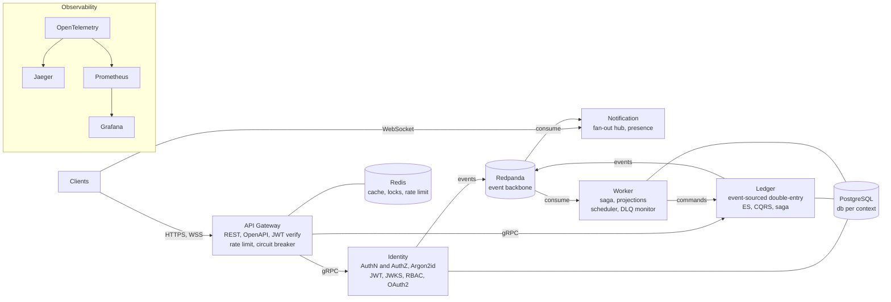
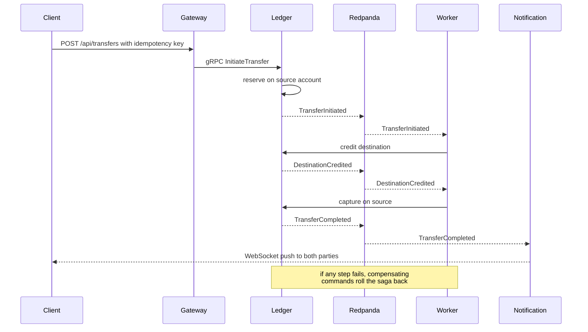

# Atlas

**A production-grade, event-sourced payments ledger backend in Rust.**

[](https://github.com/mansiverma897993/Atlas/actions/workflows/ci.yml)
[](https://github.com/mansiverma897993/Atlas/actions/workflows/docker.yml)
[](./LICENSE)
[](./rust-toolchain.toml)

An enterprise-grade, event-sourced **double-entry ledger / payments** backend built to
demonstrate senior backend and distributed-systems engineering: Domain-Driven Design,
hexagonal architecture, Event Sourcing, CQRS, sagas, an event-driven backbone, resilience
patterns, and cloud-native operations.

**Status: implemented.** A Cargo workspace of 5 service binaries and 6 shared libraries.
The whole workspace compiles, `cargo clippy` is clean, `cargo fmt --check` passes, and
**122 tests pass** — including an in-process end-to-end transfer test and a conservation
property test over randomized schedules. Local run and cloud deploy are wired
(`deploy/docker-compose.yml`, `deploy/k8s/`). See the [roadmap](./docs/ROADMAP.md) for phases.

---

## Table of contents

- [Why a ledger?](#why-a-ledger)
- [Architecture](#architecture)
- [How a transfer flows](#how-a-transfer-flows)
- [Getting started](#getting-started)
- [Running the full stack](#running-the-full-stack)
- [Production setup](#production-setup)
- [Workspace layout](#workspace-layout)
- [Documentation](#documentation)
- [Technology](#technology)
- [Engineering principles](#engineering-principles)
- [Contributing](#contributing)
- [License](#license)

## Why a ledger?

Because a payments ledger is the domain where the "senior" patterns are **load-bearing, not
decorative**. A ledger that loses, duplicates, or reorders a posting is broken — that
constraint is what forces Event Sourcing, CQRS, sagas, idempotency, distributed locking, and
dead-letter queues to be real rather than checklist items. The system exists to protect four
invariants: **conservation** (`Σ debits = Σ credits`), **no double-spend**, **idempotent
retries**, and **immutable audit**.

## Architecture



Five services, each an independent bounded context: the **gateway** is the only public
surface; **identity**, **ledger**, and **notification** own their domains; the **worker**
coordinates sagas, projections, and scheduled jobs over the Redpanda event backbone. Each
context owns its own PostgreSQL database — there are no shared tables.

## How a transfer flows

A transfer is a **saga**: reserve on source → credit destination → capture on source, with
compensation on failure — coordinated over the event backbone, observable as a single
distributed trace, and delivered live to both parties over WebSocket.



## Getting started

### Prerequisites

| Tool | Version | Needed for |
|---|---|---|
| [Rust](https://rustup.rs) | 1.96 (pinned in [`rust-toolchain.toml`](./rust-toolchain.toml)) | building and testing |
| [Docker](https://docs.docker.com/get-docker/) + Compose | any recent | running the full local stack |
| [just](https://github.com/casey/just) | optional | developer command runner |
| [k6](https://k6.io) | optional | load / smoke tests |

No system `protoc` (vendored), no C compiler or `librdkafka` (pure-Rust `rskafka`), and no
native TLS (`rustls`) are required — the workspace builds with the stock Rust toolchain.

### Build and test

```bash
git clone https://github.com/mansiverma897993/Atlas.git
cd Atlas

# build & verify everything (no infra needed — pure-Rust deps, in-memory test adapters)
cargo build --workspace
cargo test  --workspace          # 122 tests
cargo clippy --workspace
cargo bench -p ledger            # event-replay benchmark (criterion)
```

Or with `just`:

```bash
just check    # type-check everything
just test     # full test suite
just lint     # clippy, warnings are errors
just fmt      # format the workspace
```

### Configure the environment

Configuration is layered: `defaults → config/{RUN_ENV}.toml → environment`. Every variable
uses the `APP` prefix with `__` as the nesting separator.

```bash
cp .env.example .env    # then adjust as needed
```

The defaults in `.env.example` assume the docker-compose stack below (Postgres `app:app` on
`localhost:5432`, Redis on `6379`, Redpanda on `9092`). Service ports:

| Service | Port(s) | Metrics |
|---|---|---|
| gateway | 8080 (HTTP) | 9100 |
| identity | 8081 (health) · 50051 (gRPC) | 9101 |
| ledger | 8082 (health) · 50052 (gRPC) | 9102 |
| notification | 8083 (WS/health) | 9103 |
| worker | 8084 (health) | 9104 |

## Running the full stack

```bash
# services + Postgres + Redis + Redpanda + Jaeger + Prometheus + Grafana
docker compose -f deploy/docker-compose.yml up --build

# or: just up
```

Then:

- **API**: `http://localhost:8080` (OpenAPI/Swagger UI at `/docs`)
- **Traces**: Jaeger at `http://localhost:16686`
- **Metrics**: Prometheus at `http://localhost:9090`, Grafana at `http://localhost:3000`

Smoke- and load-test the running gateway:

```bash
BASE_URL=http://localhost:8080 k6 run tests/load/smoke.js
BASE_URL=http://localhost:8080 k6 run tests/load/stress.js
```

## Production setup

The full authentication chain runs out of the box in production: identity signs with a
stable RSA key (`APP__JWT__PRIVATE_KEY_PEM`), the gateway auto-fetches and refreshes its
JWKS, the public auth surface is rate-limited and bounded, security headers are emitted at
the edge, and `RUN_ENV=production` fails fast on insecure defaults (localhost DBs, default
credentials, placeholder tokens).

Everything an operator must supply by hand — database URLs, JWT keys, admin tokens,
hostnames, TLS — is documented step-by-step in
**[docs/PRODUCTION_SETUP.md](./docs/PRODUCTION_SETUP.md)** (also available as the printable
**[Manual-Setup-Guide.pdf](./Manual-Setup-Guide.pdf)**), ending with a production-readiness
checklist. Kubernetes manifests live in [`deploy/k8s/`](./deploy/k8s) (kustomize base +
production overlay).

Generate the JWT signing key pair:

```bash
openssl genpkey -algorithm RSA -pkeyopt rsa_keygen_bits:2048 -out jwt_private.pem
openssl rsa -in jwt_private.pem -pubout -out jwt_public.pem
```

## Workspace layout

| Crate | Kind | Role |
|---|---|---|
| `crates/libs/kernel` | lib | `Money`, `Currency`, typed ids, correlation ids (pure domain kernel) |
| `crates/libs/config` | lib | layered, typed, fail-fast configuration |
| `crates/libs/telemetry` | lib | tracing + metrics + (feature-gated) OTLP bootstrap |
| `crates/libs/infra` | lib | Postgres, Redis (lock/rate-limit), event bus, outbox, health |
| `crates/libs/resilience` | lib | circuit breaker, retry, exponential backoff |
| `crates/libs/proto` | lib | generated gRPC contracts (tonic) |
| `crates/gateway` | bin | public REST/OpenAPI edge, JWT verify, rate limit, breaker, gRPC routing |
| `crates/identity` | bin | AuthN/Z (gRPC): Argon2id, JWT/JWKS, rotating refresh, RBAC, OAuth2 |
| `crates/ledger` | bin | event-sourced double-entry ledger (gRPC, ES + CQRS + saga) |
| `crates/notification` | bin | WebSocket fan-out hub, presence |
| `crates/worker` | bin | scheduler, audit sink, cross-context provisioning, DLQ monitor |

## Documentation

| Doc | What it covers |
|---|---|
| **[docs/ARCHITECTURE.md](./docs/ARCHITECTURE.md)** | The authoritative system design: contexts, communication, resilience, observability, security, config, deployment. |
| **[docs/DOMAIN.md](./docs/DOMAIN.md)** | The ledger DDD model: aggregates, value objects, events, commands, invariants, the transfer saga, read models. |
| **[docs/ROADMAP.md](./docs/ROADMAP.md)** | Phased delivery plan (0–7) with acceptance criteria per phase. |
| **[docs/PRODUCTION_SETUP.md](./docs/PRODUCTION_SETUP.md)** | Everything you must supply by hand — DB URLs, JWT keys, tokens, hostnames — to run locally and in prod. |
| **[docs/CONVENTIONS.md](./docs/CONVENTIONS.md)** | Coding conventions, port allocation, naming. |
| **[docs/adr/](./docs/adr)** | Architecture Decision Records — the *why* behind every major choice. |

## Technology

**Language/runtime:** Rust · Tokio · Axum · Tower · tonic (gRPC) · SQLx
**Data:** PostgreSQL · Redis · Redpanda (Kafka API)
**Observability:** OpenTelemetry · Jaeger · Prometheus · Grafana
**Ops:** Docker Compose · Kubernetes · GitHub Actions
**Quality:** proptest · cargo-fuzz · criterion · goose · testcontainers

## Engineering principles

- **Domain-Driven Design** with explicit bounded contexts and a ubiquitous language.
- **Hexagonal architecture** — pure domain, ports as traits, adapters at the edge, DI at the
  composition root ([ADR-0002](./docs/adr/0002-hexagonal-architecture.md)).
- **Event Sourcing + CQRS**, scoped deliberately to where they pay for themselves
  ([ADR-0003](./docs/adr/0003-event-sourcing-scope.md), [ADR-0004](./docs/adr/0004-cqrs.md)).
- **Resilience by construction** — timeouts, retries with backoff, circuit breakers,
  bulkheads, rate limits, DLQ.
- **Observability by construction** — one distributed trace per transfer across sync and async
  hops ([ADR-0012](./docs/adr/0012-observability-otel.md)).
- **Scope discipline** — every non-goal is a recorded decision, not an oversight
  ([ARCHITECTURE §10](./docs/ARCHITECTURE.md#10-explicit-non-goals-scope-discipline)).

## Contributing

See [CONTRIBUTING.md](./CONTRIBUTING.md) for the development workflow and how to run the
quality gates locally. Coding conventions live in
[docs/CONVENTIONS.md](./docs/CONVENTIONS.md).

## License

Atlas is licensed under the **Apache License 2.0**. See [LICENSE](./LICENSE) for the full
text.

Copyright (c) 2026 Mansi Verma.
